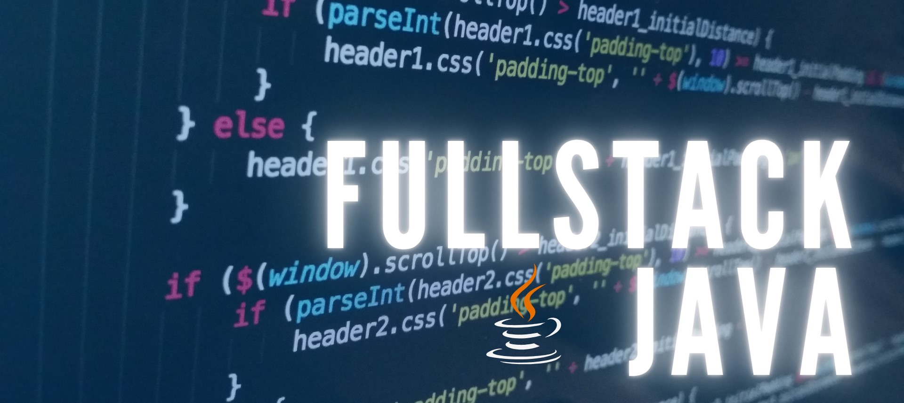

    
  </a>

## Developer - Java, Spring Boot, HTML, CSS, Bootstrap

---

### About Me

I am Esteban Moya, an enthusiastic developer with a strong foundation in **Java**, **Spring Boot**, **HTML**, **CSS**, and **Bootstrap**. I am passionate about building robust and efficient applications while continuously learning and growing in the software development field.

---

### Skills

| Skill          | Logo |
|----------------|------|
| **Java**       |  |
| **Spring Boot**|  |
| **HTML**       |  |
| **CSS**        |  |
| **Bootstrap**  |  |

---

### GitStatus

  

---

### Projects

Here are some of my featured projects:

- **[Project 1](#)**: A brief description of what this project does and what technologies it uses.
- **[Project 2](#)**: A brief description of what this project does and what technologies it uses.
- **[Project 3](#)**: A brief description of what this project does and what technologies it uses.

---

### Contact Me

- **Email**: [moyamena@gmail.com](mailto:moyamena@gmail.com)
- **LinkedIn**: [https://www.linkedin.com/in/esteban-moya-mena/](#)

